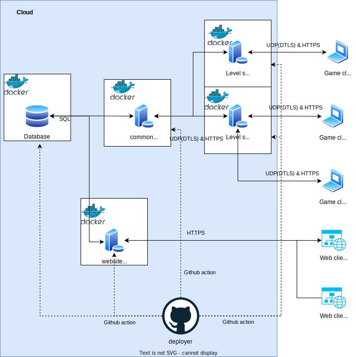

# jdungeon-overview
An overview repo to link everything together for the jdungeon project
## Repositories
- [client](https://github.com/jonathaneeckhout/jdungeon-client)
- [level-server](https://github.com/jonathaneeckhout/jdungeon-level-server)
- [common-server](https://github.com/jonathaneeckhout/jdungeon-common-server)
- [website](https://github.com/jonathaneeckhout/jdungeon-website)
- [database](https://github.com/jonathaneeckhout/jdungeon-database)
- [deployer](https://github.com/jonathaneeckhout/jdungeon-deployer)

## Architecture


## How to run locally
This section explains how to run your own instance of JDungeon. It will provide example commands focussed on Linux but the main concepts can be transfered to Windows as well.
### Dependencies
Make sure the following packages/programs are installed
- git
- node
- npm
- docker
- docker-compose
- godot version 4.x (take the latest stable)
### Setup
Download all the needded repos, for ease of use make a general jdungeon directory
```bash
cd <your workspace>
mkdir jdungeon
cd jdungeon
git clone https://github.com/jonathaneeckhout/jdungeon-client
git clone https://github.com/jonathaneeckhout/jdungeon-level-server
git clone https://github.com/jonathaneeckhout/jdungeon-common-server
git clone https://github.com/jonathaneeckhout/jdungeon-website
git clone https://github.com/jonathaneeckhout/jdungeon-database
```
Next we need to generate some self signed certificates that will be used for TLS. Use the following script inside the jdungeon folder to generate the certificates.
```bash
#!/bin/bash

# Change the following variables as needed
domain="localhost"
validity_days=365

# Generate private key and CSR
openssl req -new -newkey rsa:2048 -nodes -keyout "$domain.key" -out "$domain.csr" -subj "/C=US/ST=State/L=City/O=Organization/OU=Unit/CN=$domain/emailAddress=admin@$domain"

# Generate self-signed certificate
openssl x509 -req -days $validity_days -in "$domain.csr" -signkey "$domain.key" -out "$domain.crt"

# Optional: Display the generated certificate
openssl x509 -text -noout -in "$domain.crt"
```
#### jdungeon-database
Make sure that you have docker and docker-compose installed for this step.
Create the .env file.
```bash
cd jdungeon-database
nano .env
```
The content of .env file is.
```bash
POSTGRES_USER=testuser
POSTGRES_PASSWORD=testpassword
POSTGRES_DB=jdungeon
```
Next you can run the database in the terminal.
```bash
docker-compose up
```
Or if you want to deamonize it.
```bash
docker-compose up -d
```
#### jdungeon-website
Make sure that you have node and npm installed for this step.
Create the .env file.
```bash
cd jdungeon-website
npm install
nano .env
```
The content of the .env file is.
```bash
POSTGRES_HOST=localhost
POSTGRES_PORT=5432
POSTGRES_USER=testuser
POSTGRES_PASSWORD=testpassword
POSTGRES_DB=jdungeon

DEBUG=true

CERT_PATH=../localhost.crt
KEY_PATH=../localhost.key
```
Next you can run the database in the terminal.
```bash
node main.js
```
Open up your browser and go the following link.
```bash
https://localhost:8443
```
Accept the risk as the website uses your own self signed certificate.
Go to the create account section and fill in some credentials.
```bash
username: testplayer
email: test@test.com
password: testpassword
```
When pressing register check your terminal and a link should be printed to the /verify path. Copy this link and open it in your browsers and verify the account. If succeeded the account is ready to be used in the client.

#### jdungeon-common-server
Make sure that you have node and npm installed for this step.
Create the .env file.
```bash
cd jdungeon-common-server
npm install
nano .env
```
The content of the .env file is.
```bash
POSTGRES_HOST=localhost
POSTGRES_PORT=5432
POSTGRES_USER=testuser
POSTGRES_PASSWORD=testpassword
POSTGRES_DB=jdungeon

STARTER_LEVEL="Grassland"
STARTER_POS ='{"x":128.0,"y":128.0}'

APP_PORT=3000
APP_CRT=../localhost.crt
APP_KEY=../localhost.key

COOKIE_SECRET="jdungeon"
```
The common server can also populate the database with some credential information needed for the level servers. This is done by creating a .init.json file.
```bash
nano .init.json
```
And the content of the .init.json file is.
```json
{
   "levels": [
       {
           "level": "Grassland",
           "key": "testpassword",
           "address": "127.0.0.1",
           "port": 4432
       }
   ]
}
````
Next you can run the database in the terminal.
```bash
node main.js
```
#### jdungeon-level-server
Make sure that you godot installed for this step
Create the .env file.
```bash
cd jdungeon-level-server
nano .env
```
The content of .env file is.
```bash
DEBUG=true

LEVEL_PORT=4432
LEVEL_MAX_PEERS=128

LEVEL="Grassland"
SECRET="testpassword"

LEVEL_CRT=../localhost.crt
LEVEL_KEY=../localhost.key

COMMON_SERVER_ADDRESS="https://localhost:3000"
```
Next you can open op the godot project via de gui or via command line.
```bash
Godot_v4.x project.godot
```
Now just run the multiplayer scene.
#### jdungeon-client
Make sure that you godot installed for this step.
Create the .env file.
```bash
cd jdungeon-client
nano .env
```
The content of .env file is.
```bash
DEBUG=true

COMMON_SERVER_ADDRESS=https://localhost:3000
COMMON_SERVER_HOST=localhost
COMMON_SERVER_PORT=3000

DEBUG_USERNAME=testplayer
DEBUG_PASSWORD=testpassword
```
Next you can open op the godot project via de gui or via command line.
```bash
Godot_v4.x project.godot
```
Now just run the multiplayer scene and login to the server.
## How to contribute
